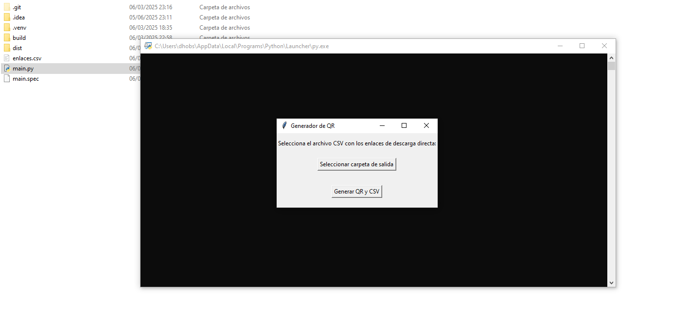

# GeneradorQR

**Aplicación de escritorio** para generar códigos QR de forma masiva a partir de un archivo CSV.



---

## ✨ Características

- Interfaz gráfica sencilla con Tkinter.
- Selección fácil de carpeta de salida.
- Generación masiva de códigos QR.
- Creación automática de un CSV con los resultados.

## 🛠 Tecnologías

- Python 3
- Tkinter (interfaz)
- qrcode

## 🚀 Instalación

```bash
git clone https://github.com/Deve-Lopez/GeneradorQR.git
cd GeneradorQR
pip install -r requirements.txt
python main.py


▶️ Uso
Ejecuta la aplicación:
Bashpython main.py
Selecciona la carpeta de salida y el archivo CSV con los enlaces.
📋 Formato del CSV
El archivo debe tener dos columnas:

Primera columna: Nombre del producto
Segunda columna: Enlace de descarga directa

📄 Licencia
Este proyecto es de uso libre.